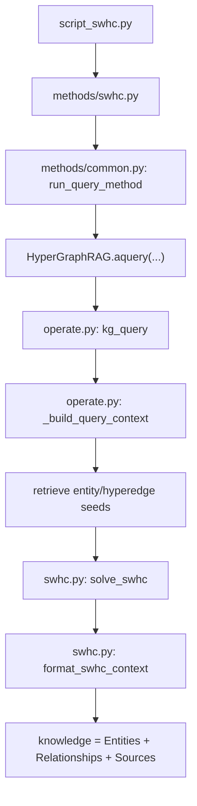

# SWHC 方法设计与实现说明

## 1. 方法定位

`Semantic Wiener HyperConnector (SWHC)` 是在 `HyperGraphRAG` 基础上实现的一个 **query-time 证据子图组装器**。它不改动文档切块、实体/超边抽取、超图存储和向量索引的建图流程，而是在查询阶段替换原始 `HyperGraphRAG` 的“邻域并集式上下文组装”逻辑。

目标很明确：

- 保留 `HyperGraphRAG` 对 n-ary fact 的表达能力
- 用一个更紧凑、更低冗余、更面向生成的子图选择目标替换启发式拼接
- 在相同或更小的上下文预算下，提升多跳问题的证据组织质量

一句话概括：

> HyperGraphRAG 解决了“如何表示 n-ary facts”，SWHC 进一步解决“如何把 query 相关事实组装成一个适合生成的证据子图”。

---

## 2. 与 HyperGraphRAG 的关系

### 2.1 不变的部分

SWHC 继承了 HyperGraphRAG 的整个建图阶段：

1. 原始文档读入
2. chunk 切分
3. LLM 抽取实体与 hyperedge
4. 用二部图表示超图
5. 建立三个索引：
   - `chunks_vdb`
   - `entities_vdb`
   - `hyperedges_vdb`

这些逻辑仍然由以下代码负责：

- 基线主类：`D:\PythonProjects\HyperGraphRAG\evaluation\hypergraphrag\hypergraphrag.py`
- 建图/查询主逻辑：`D:\PythonProjects\HyperGraphRAG\evaluation\hypergraphrag\operate.py`

### 2.2 改动的部分

SWHC 只改 **查询阶段的上下文组装**：

- 原始 `HyperGraphRAG`：local/global 检索后，做邻域扩展和上下文拼接
- `SWHC`：先召回 seeds，再在候选子图上求一个语义加权的连接子图，最后从这个子图导出 `Entities / Relationships / Sources`

对应的查询入口参数是：

- `QueryParam(only_need_context=True, subgraph_selector="swhc")`

实际评测脚本入口：

- `D:\PythonProjects\HyperGraphRAG\evaluation\methods\swhc.py`
- 兼容脚本：`D:\PythonProjects\HyperGraphRAG\evaluation\script_swhc.py`

### 2.3 原始 HyperGraphRAG 检索后的输出形式

这里有一个很容易误解的点：`HyperGraphRAG` 在 `local / global / hybrid` 检索之后，**并不会把图对象或向量直接交给大模型**。真正喂给 LLM 的，是一段文本化的结构上下文，主要由三部分组成：

1. `Entities`
2. `Relationships`
3. `Sources`

这三部分在代码里会被组织成 CSV 字符串，然后拼成最终的 `context_data`，再填入生成 prompt。

可以粗略理解为：

- 向量：只用于前面的 seed 召回
- 图：只用于前面的邻域扩展和 source 回收
- LLM 最终看到的是：**表格化文本**

一个最小示意例如下：

```text
-----Entities-----
id,entity,type,description
0,RENAL DENERVATION,PROCEDURE,A catheter-based procedure to lower blood pressure
1,RESISTANT HYPERTENSION,DISEASE,Hypertension uncontrolled by a standard three-drug regimen

-----Relationships-----
id,hyperedge,related_entities
0,"renal denervation may be considered for resistant hypertension","RENAL DENERVATION|RESISTANT HYPERTENSION"

-----Sources-----
id,content
0,"Renal denervation may be considered in selected patients with uncontrolled resistant hypertension ..."
```

因此，原始 `HyperGraphRAG` 的 `hybrid` 也不是“把整个图交给模型”，而是：

- 先分别得到 local 的 `Entities / Relationships / Sources`
- 再分别得到 global 的 `Entities / Relationships / Sources`
- 最后把它们去重合并，拼成一段文本上下文交给 LLM

这也是 `SWHC` 可以无缝接入现有评测链的原因：它虽然改变了检索后的组装方式，但最终输出的仍然是兼容 `Entities / Relationships / Sources` 格式的上下文。

---

### 2.4 当前评价指标说明

当前评测主链实际使用 4 个核心指标：

- `EM`：Exact Match。对生成答案做归一化（小写、去标点、去冠词、规范空格）后，与任一 `golden_answers` 完全匹配则记为 1，否则为 0。
- `F1`：token overlap F1。对归一化后的答案按词切分，与任一标准答案分别计算 token-level precision / recall / F1，取最大值。
- `R-Sim`：retrieval similarity。将黄金支撑知识 `context` 拼接成文本，再与检索得到的 `knowledge` 做 SimCSE 相似度，衡量检索上下文与黄金证据的接近程度。
- `Gen`：LLM judge 指标。对每条生成结果从 `comprehensiveness`、`knowledgeability`、`correctness`、`relevance`、`diversity`、`logical_coherence`、`factuality` 七个维度分别打分。judge prompt 会输入 `question`、`golden_answers` 和 `generation`，要求输出 `<score>0-10</score>` 与 `<explanation>...</explanation>`。代码中每个维度的最终分数不是纯 judge 分，而是 `((judge_score / 10) + F1) / 2`；最后再对 7 个维度求平均，得到 `Gen`。

一个最小示意例如下：如果某条样本的 `F1=0.67`，judge 在 `correctness` 维度给出 `8/10`，那么该维度最终分数为：

$$
\frac{0.8 + 0.67}{2} = 0.735
$$

这样设计的直觉是：

- `EM / F1` 评估答案是否答对；
- `R-Sim` 评估检索结果是否接近黄金证据；
- `Gen` 评估生成质量，但又用 `F1` 对 LLM judge 做一层约束，避免完全主观打分。

---

## 3. 运行时实际生效的代码位置

仓库里有两套实现：

1. 根目录包：`D:\PythonProjects\HyperGraphRAG\hypergraphrag\...`
2. 评测包：`D:\PythonProjects\HyperGraphRAG\evaluation\hypergraphrag\...`

**评测与论文复现时真正生效的是第 2 套，即 `evaluation/hypergraphrag/`。**

因此，理解和修改 SWHC 时，优先看下面这些文件：

- 方法入口：`D:\PythonProjects\HyperGraphRAG\evaluation\methods\swhc.py`
- 查询公用入口：`D:\PythonProjects\HyperGraphRAG\evaluation\methods\common.py`
- 查询主链：`D:\PythonProjects\HyperGraphRAG\evaluation\hypergraphrag\operate.py`
- SWHC 核心实现：`D:\PythonProjects\HyperGraphRAG\evaluation\hypergraphrag\swhc.py`
- 查询参数定义：`D:\PythonProjects\HyperGraphRAG\evaluation\hypergraphrag\base.py`

---

## 4. 查询阶段的整体流程

### 4.1 调用链

SWHC 的调用路径如下：



### 4.2 每步做什么

1. `methods/swhc.py` 指定这是 `SWHC` 方法，并构造：
   - `QueryParam(only_need_context=True, subgraph_selector="swhc")`
2. `methods/common.py` 负责：
   - 加载数据集问题
   - 创建 `HyperGraphRAG` 实例
   - 并发调用 `rag.aquery(question, query_param)`
3. `operate.py` 中的 `kg_query` 先做 query 抽取和种子召回
4. `_build_query_context` 检测到 `subgraph_selector == "swhc"`
5. 调 `solve_swhc(...)` 选择证据子图
6. 调 `format_swhc_context(...)` 把子图转换成最终上下文字符串

---

## 5. SWHC 的方法设计

## 5.1 输入对象

SWHC 在查询阶段接收两类 seed：

- `entity seeds`
- `hyperedge seeds`

这两类种子仍由 HyperGraphRAG 的原始检索链提供，而不是 SWHC 自己重新召回。因此 SWHC 的职责不是“替代召回”，而是“替代召回后的上下文组装”。

## 5.2 terminals 的定义

SWHC 不把 terminal 只定义成实体，而是把以下节点都视作可能的重要终端：

- 高分实体节点
- 高分 hyperedge 节点

这比传统 entity-only connector 更适合 HyperGraphRAG，因为 HyperGraphRAG 的核心知识单元本来就是 hyperedge。

## 5.3 候选子图

SWHC 不直接在全图上做优化，而是先从 seeds 出发构造候选子图：

- 从 seed 节点向外做 `hops` 跳 BFS
- 收集访问到的节点和边
- 形成一个局部候选图 `C_q`

这一步在代码里由：

- `build_candidate_subgraph(...)`

完成。

设计动机：

- 避免在全局图上做昂贵搜索
- 保留 query 局部相关结构
- 便于后续做更快的 connector 构造

## 5.4 语义加权

SWHC 不是只看结构距离，还给节点和路径加上语义偏置。

### 节点分数

节点分数由 `_derive_node_scores(...)` 计算：

- 对实体节点，主要考虑：
  - 它是否是高分 seed
  - 它的图度
- 对 hyperedge 节点，主要考虑：
  - seed 分数
  - hyperedge 自身的 `weight`
  - 节点度

设计直觉：

- 被 query 明确命中的节点，优先级更高
- 能桥接多个事实的节点，也更值得进入子图
- hyperedge 自身的质量不能被忽略

### 边权重

`_add_semantic_edge_weights(...)` 会在候选图边上写入 `swhc_weight`，综合考虑：

- 原始边 `weight`
- 两端节点的语义分数

这样得到的最短路，不再是单纯的 hop 最短路，而是更偏向：

- 经过高语义相关节点的路径
- 避开语义弱、结构噪声大的路径

## 5.5 目标函数思想

SWHC 的实现是一个 practical heuristic version，不追求完全复现 MWC 论文里的理论近似过程。

但它仍然保留了“**更紧凑的 terminal 连接子图更好**”这条主线。具体通过以下三项来近似：

1. `wiener` 项：terminal 间在子图中的加权距离
2. `node_cost` 项：节点 token 成本 + 语义惩罚
3. `size_penalty` 项：控制子图规模

### 改进版 Wiener 项

设：

  - $T_q$ 表示 query $q$ 对应的 terminal 集合
  - $H$ 表示最终选出的证据子图
  - $\pi_q(t)$ 表示 terminal $t$ 的归一化重要性权重
  - $d_H^{\text{sem}}(u,v)$ 表示在子图 $H$ 中、按语义加权边代价计算得到的最短路距离

则 SWHC 使用的改进版 Wiener 项可以写成：

$$
W_{\text{SWHC}}(H \mid q)
=
\sum_{u,v \in T_q,\; u < v}
\pi_q(u)\,\pi_q(v)\,d_H^{\text{sem}}(u,v)
$$

这个式子和标准 Wiener index 的区别有两点：

1. 它**只对 query 相关的 terminals 求和**，而不是对整张子图中所有节点求和；
2. 它引入了 **terminal 权重** 和 **语义加权距离**，因此更符合 RAG 场景里的“重要证据优先”和“相关路径优先”。

可以把这一项理解成：

> 对当前 query 最重要的那些节点，如果它们在最终子图里彼此很远，那么这个子图就不好；如果它们能通过一条较短、较可信的路径被连接起来，那么这个子图就更适合作为最终证据结构。

其中几项的直觉如下：

- $T_q$：当前 query 下最重要的 terminal 集合。它不是整张图里的所有节点，而是从召回结果里进一步挑出的关键节点。
- $\pi_q(t)$：terminal $t$ 的重要性权重。越像 query 真正关心的核心点，权重越大。
- $d_H^{\text{sem}}(u,v)$：不是普通 hop 距离，而是“按语义加权边代价计算出来的最短路距离”。

因此，这一项实际上在表达：

> 让最重要的 terminals 在最终子图里尽量靠近，而且这种“靠近”要沿着语义更可信的路径实现。

### 语义加权距离

在当前实现里，候选图中的边会先被写入一个 `swhc_weight`。如果记边 `e=(i,j)` 的原始置信权重为 `conf(i,j)`，节点语义分数为 `s(i), s(j)`，则当前实现对应的边代价可近似写成：

$$
w_{\text{sem}}(i,j)
=
\max\left(
 \varepsilon,\;
\frac{1}{\sqrt{\max(conf(i,j),1)}}
+
\left(1 - \frac{s(i)+s(j)}{2}\right)
+
c_{\text{hop}}
\right)
$$

于是：

$$
d_H^{\text{sem}}(u,v)
=
\operatorname{ShortestPath}_{H}(u,v; w_{\text{sem}})
$$

直觉上，这意味着：

- 边的原始置信度越高，路径代价越低；
- 路径经过的节点语义分数越高，路径代价越低；
- 因此最短路不再只是“hop 最短”，而是“更偏向语义可信路径”的最短路。

这一项拆开看更容易理解：

1. $\frac{1}{\sqrt{\max(conf(i,j),1)}}$
   - 表示边本身的“置信度代价”
   - 边越可靠，代价越低
   - 这里用开根号做平滑，是为了强调高置信边，但又不让极端大权重完全支配路径选择

2. $1 - \frac{s(i)+s(j)}{2}$
   - 表示两端节点的语义惩罚
   - 如果两端节点都更相关，这项更小
   - 如果两端节点语义弱，这项更大

3. $c_{\text{hop}}$
   - 表示每走一条边的基础 traversal 成本
   - 它让路径代价不仅由“边置信度”和“节点语义”决定，还显式考虑 hop 本身的代价

4. $\max(\varepsilon,\cdot)$
   - 给边代价加一个下界
   - 防止出现几乎“零成本”的边，保持最短路搜索稳定

所以，$w_{\text{sem}}(i,j)$ 的设计目标是：

> 让路径不仅结构可达，而且更愿意经过“高置信边 + 高语义节点”，同时不过度奖励过长的桥接路径。

### 完整目标函数

在此基础上，SWHC 的当前实现可以形式化为：

$$
J(H \mid q)
=
\alpha \, W_{\text{SWHC}}(H \mid q)
+
\beta \sum_{v \in V(H)}
\left(
\frac{\text{Tok}(v)}{256}
+
1 - s(v)
\right)
+
\gamma |V(H)|
$$

其中：

  - $\text{Tok}(v)$ 表示节点文本的 token 成本；
  - $s(v)$ 表示节点语义分数；
  - $|V(H)|$ 表示子图节点数；
  - $\alpha,\beta,\gamma$ 分别对应：
  - `swhc_alpha`
  - `swhc_beta`
  - `swhc_gamma`

这个目标函数的含义可以理解为：

1. 第一项鼓励重要 terminals 之间在子图里更接近；
2. 第二项惩罚高 token 成本、低语义质量的节点；
3. 第三项惩罚子图过大，避免上下文无节制膨胀。

这三项分别解决的是三个不同问题：

1. **结构问题**
   - terminals 是否被组织成一个紧凑的子图
   - 对应第一项 $W_{\text{SWHC}}(H \mid q)$

2. **内容问题**
   - 被保留的节点是否过长、是否不够相关
   - 对应第二项 `node_cost`

3. **规模问题**
   - 即使每个节点都不算太差，整张图会不会仍然过大
   - 对应第三项 `size_penalty`

如果没有后两项，只优化 Wiener 项，系统容易不断加入桥接节点来缩短 terminal 距离，最后得到一个“图上很好看、但给 LLM 太贵”的结果。  
所以 SWHC 的完整目标本质上是在做三方平衡：

- 结构紧凑
- 语义相关
- 上下文可控

### 与当前代码的对应关系

当前实现中，对应关系如下：

- $W_{\text{SWHC}}(H \mid q)$  
    对应 `_compute_objective(...)` 里对 terminal pair 的加权距离求和
- $\pi_q(t)$  
    对应 `_compute_terminal_weights(...)`
  - $s(v)$  
    对应 `_derive_node_scores(...)`
- $w_{\text{sem}}(i,j)$  
    对应 `_add_semantic_edge_weights(...)`
- 第二项的 token 成本与语义惩罚  
    对应 `_compute_objective(...)` 中的 `node_cost`
- 第三项  
    对应 `_compute_objective(...)` 中的 `size_penalty`

因此，虽然当前实现不是严格的理论近似算法，但已经对应了一个相对清晰的“语义加权 Wiener + 成本正则”目标。

### 当前默认参数

当前实现里的默认参数是：

- $\alpha = 1.0$
- $\beta = 0.15$
- $\gamma = 0.05$
- $\varepsilon = 0.05$
- $c_{\text{hop}} = 0.25$

对应代码位置：

- `D:\PythonProjects\HyperGraphRAG\evaluation\hypergraphrag\base.py`

即：

- `swhc_alpha: float = 1.0`
- `swhc_beta: float = 0.15`
- `swhc_gamma: float = 0.05`
- `swhc_edge_weight_floor: float = 0.05`
- `swhc_hop_cost: float = 0.25`

这组默认值的含义是：

- 最重视结构紧凑性（Wiener 项）
- 其次关注节点的 token 成本与语义质量
- 最后对整体节点数做一个较轻的额外约束
- 边权内部再通过一个较小的 $\varepsilon$ 保持稳定，并通过 $c_{\text{hop}}$ 显式控制 hop 成本

也就是说，当前默认策略是：

> 先保证关键 terminals 连接得足够好，再适度惩罚“长且不相关”的节点，同时避免图规模失控。

### 每个参数怎么理解

#### $\alpha$：结构紧凑项的权重

它控制：

- terminal 间距离在目标函数里有多重要

调大后：

- 更偏向让 terminals 彼此更近
- 更愿意为了缩短路径引入桥接节点

调小后：

- 更不执着于 terminals 的紧密连接
- 更像一个偏内容筛选的模型

#### $\beta$：节点内容成本的权重

它控制：

- token 成本和语义惩罚在目标函数里有多重要

调大后：

- 更偏向短小、相关的节点
- 更容易压缩上下文
- 但也更容易把有用的桥接节点剪掉

调小后：

- 对长节点和弱相关节点更宽容
- 子图可能更完整，但也更容易膨胀

#### $\gamma$：整体规模惩罚的权重

它控制：

- 子图节点数量本身有多重要

调大后：

- 更偏向小图
- 更容易压缩节点数
- 但过大时会伤害多跳链路，尤其是 `3-hop`

调小后：

- 对子图规模更宽容
- 更容易保留辅助连接节点

#### $\varepsilon$：边权下界

它控制：

- 单条边最小可以有多便宜

当前默认值为：

- $\varepsilon = 0.05$

一般不建议大幅调整，因为它主要是一个数值稳定项，而不是核心建模项。

#### $c_{\text{hop}}$：基础 hop 成本

它控制：

- 每跨过一条边是否需要额外付出固定代价

当前默认值为：

- $c_{\text{hop}} = 0.25$

调大后：

- 更偏好更短的路径
- 更强地抑制多余桥接

调小后：

- 更容易接受稍长但语义上更好的路径
- 子图往往更完整，但也更可能膨胀

### 为什么需要同时有 $\beta$ 和 $\gamma$

这两项看起来都在“压图”，但作用不一样：

1. $\beta$ 是**节点级约束**
   - 关注每个节点本身值不值得保留
   - 惩罚长节点和低语义节点

2. $\gamma$ 是**全局规模约束**
   - 关注整张图是不是太大
   - 即使每个节点都不算特别差，节点太多也要被惩罚

所以：

- 只有 $\beta$，会偏向保留很多“看起来还行但数量太多”的节点
- 只有 $\gamma$，会偏向盲目缩图，却分不清高质量节点和低质量节点

两者一起用，才能同时约束：

- 节点质量
- 图整体规模

### 调参建议

当前结果表明默认参数已经能跑出支持性结果，因此不建议一开始就大幅改动三个参数。  
更稳妥的做法是：

1. **先固定 $\alpha = 1.0$**
   - 因为当前方法的核心仍然是 connector-style assembly
   - 不建议先把结构项削弱

2. **优先调 $\beta$**
   - 因为当前最常见的问题不是“图完全连不好”，而是“是否压缩过强、是否删掉了有用外围信息”

3. **再调 $\gamma$**
   - 用来控制整体图规模是否过度膨胀或过度压缩

4. **最后才微调 $\alpha$**
   - 只有在你已经理解了上下文规模与 F1 / R-Sim 的关系后，再去调整结构项权重

### 推荐的第一轮小范围搜索

建议先固定：

- $\alpha = 1.0$
- $\varepsilon = 0.05$

然后做一个小网格：

- $\beta \in \{0.10, 0.15, 0.20\}$
- $\gamma \in \{0.02, 0.05\}$
- $c_{\text{hop}} \in \{0.20, 0.25, 0.30\}$

这是一个比较稳妥的起点，因为：

- 当前默认值 $(\alpha,\beta,\gamma,\varepsilon,c_{\text{hop}}) = (1.0, 0.15, 0.05, 0.05, 0.25)$ 已经有效
- 不需要一下子把搜索空间拉太大
- 先看 `2-hop` 是否改善、上下文是否反弹过多

### 当前结果下的具体建议

结合目前 `hypertension` 的结果：

- `3-hop` 提升明显
- `2-hop` 有轻微退化
- 上下文压缩已经很强

这说明当前默认参数大方向是对的，但可能存在**压缩略强**的问题。  
因此下一步更值得尝试的是：

1. $(\alpha,\beta,\gamma,c_{\text{hop}}) = (1.0, 0.10, 0.05, 0.25)$
2. $(1.0, 0.15, 0.02, 0.25)$
3. $(1.0, 0.10, 0.02, 0.20)$
4. $(1.0, 0.20, 0.05, 0.30)$ 作为更保守压缩的对照组

### 调参时重点观察什么

建议至少同时记录：

1. `EM`
2. `F1`
3. `R-Sim`
4. 平均上下文 token 数
5. 平均实体数 / 关系数 / sources 数
6. `1-hop / 2-hop / 3-hop` 分组结果

特别要看：

- `3-hop` 是否继续保持优势
- `2-hop` 是否能通过减小压缩强度得到修复
- token 是否在可接受范围内反弹

### 一句总结

当前目标函数的调参不应该理解成“找最高分的黑盒搜索”，而应该理解成：

> 在结构紧凑、语义相关和上下文预算之间，找到一个最适合当前任务和数据集的平衡点。

对应代码：

- `_compute_objective(...)`

总分由这些参数控制：

- `swhc_alpha`
- `swhc_beta`
- `swhc_gamma`

---

## 6. SWHC 的核心算法阶段

当前 SWHC 不是通过梯度下降、精确组合优化或原始 Wiener Connector 论文中的近似算法来求解，而是采用一个 **practical heuristic solver**。它的基本思想是：先构造一个能连通 terminals 的初始子图，再通过贪心方式逐步加入有收益的桥接路径，最后删除无收益的冗余叶子节点。整个过程始终由目标函数打分驱动，因此虽然不是全局最优求解，但不是简单的启发式拼接。

可以把当前求解过程概括为三步：

1. **初始化**：基于 terminal 两两最短路构造一个初始 connector，保证子图连通且相对紧凑。
2. **贪心改进**：反复尝试加入能显著降低目标函数的桥接路径，优先改善当前连接最差的 terminal 对。
3. **剪枝精炼**：删除对目标函数没有正收益的非 terminal 叶子节点，得到更干净、更适合生成的证据子图。

## 6.1 初始连接子图

函数：

- `_initialize_connector_subgraph(...)`

做法：

1. 用候选图上 terminal 两两最短路，构造一个 terminal 完全图
2. 在 terminal 完全图上求 MST
3. 把 MST 对应的原图路径拷回，作为初始连接子图

这一步的作用是：

- 先得到一个一定连通的、比“邻域并集”更紧的骨架子图

## 6.2 bridge augmentation

函数：

- `_augment_connector_subgraph(...)`

做法：

1. 找当前子图里 terminal 间距离最大的若干 terminal pair
2. 回到候选图里找它们的更优语义最短路
3. 如果加入这条 path 能降低总目标值，就接受
4. 迭代直到：
   - 收益低于阈值
   - 或达到节点预算
   - 或达到最大迭代轮数

核心参数：

- `swhc_bridge_max_iters`
- `swhc_min_gain`
- `swhc_budget_nodes`

设计直觉：

- 初始 connector 可能已经连通，但还不够紧凑
- 有些桥接路径能显著缩短 terminal 之间的有效距离
- 这一步就是把“更像 reasoning chain 的桥接结构”补进来

## 6.3 pruning

函数：

- `_prune_connector_subgraph(...)`

做法：

- 尝试删除非-terminal 的叶子节点
- 如果删掉后目标更优，就删除

作用：

- 清理 augmentation 带来的尾部冗余
- 让最终子图更小、更适合生成

---

## 7. 从子图导出最终上下文

函数：

- `format_swhc_context(...)`

它会把子图转成三部分：

1. `Entities`
2. `Relationships`
3. `Sources`

### 7.1 Entities

从子图里取：

- `role == entity` 的节点

排序依据：

- 节点分数
- 节点度

然后按 `max_token_for_local_context` 做截断。

### 7.2 Relationships

从子图里取：

- `role == hyperedge` 的节点

并列出它关联的实体集合，再按 `max_token_for_global_context` 截断。

### 7.3 Sources

从子图节点中回收 `source_id`，映射回原始 chunk，去重后按 token budget 截断。

这一步非常关键，因为：

- 生成模型最终真正读到的是文本证据
- SWHC 选出的结构化子图，最终要落到文本上下文上

也正因为如此，SWHC 是一个 **evidence assembly module**，不是一个纯图算法替代品。

---

## 8. 关键参数说明

SWHC 的关键参数定义在：

- `D:\PythonProjects\HyperGraphRAG\evaluation\hypergraphrag\base.py`

当前主要参数包括：

- `subgraph_selector: Literal["union", "swhc", "graphrag"] = "union"`
- `swhc_candidate_hops: int = 2`
- `swhc_seed_topk_entity: int = 8`
- `swhc_seed_topk_hyperedge: int = 8`
- `swhc_hard_terminal_topk: int = 8`
- `swhc_alpha: float = 1.0`
- `swhc_beta: float = 0.15`
- `swhc_gamma: float = 0.05`
- `swhc_bridge_max_iters: int = 20`
- `swhc_min_gain: float = 1e-3`
- `swhc_enable_prune: bool = True`
- `swhc_budget_nodes: int = 80`
- `swhc_return_debug: bool = False`

建议的理解方式：

- `candidate_hops`：候选图范围
- `seed_topk_*`：前置召回多少个 seed 参与 SWHC
- `hard_terminal_topk`：真正要求重点连接的 terminals 数量
- `alpha/beta/gamma`：结构紧凑性、内容成本、图规模三项的平衡
- `bridge_*`：控制 augmentation 强度
- `budget_nodes`：控制最终上下文不会膨胀

---

## 9. 与 HyperGraphRAG 原始组装方式的差异

### HyperGraphRAG 原始做法

- 从检索结果出发
- 做 local/global 邻域扩展
- 合并 `Entities / Relationships / Sources`

优点：

- 实现简单
- 覆盖面大

缺点：

- 没有显式优化目标
- 容易把太多相关但不必要的节点一起带进来
- 多跳问题下，证据图未必紧凑

### SWHC 做法

- 保留前置召回
- 但对召回结果构造候选图
- 在候选图上显式选择一个更紧凑的连接子图
- 最后从这个子图导出上下文

优点：

- 上下文更可控
- 更容易压缩 token
- 更接近“把事实链组装出来”而不是“把邻域都拼起来”

已在 `hypertension` 上观察到的现象是：

- 平均上下文规模明显缩小
- `EM / F1 / R-Sim` 优于原始 HyperGraphRAG
- `3-hop` 问题提升更明显

---

## 10. 代码入口速查

### 10.1 方法入口

- `D:\PythonProjects\HyperGraphRAG\evaluation\methods\swhc.py`

作用：

- 为评测脚本指定 `method_name="SWHC"`
- 构造 `QueryParam(only_need_context=True, subgraph_selector="swhc")`

### 10.2 查询调度

- `D:\PythonProjects\HyperGraphRAG\evaluation\methods\common.py`

作用：

- 加载 `questions.json`
- 实例化 `HyperGraphRAG`
- 并发执行 `aquery`
- 保存 `test_knowledge.json`

### 10.3 查询主链

- `D:\PythonProjects\HyperGraphRAG\evaluation\hypergraphrag\operate.py`

作用：

- 承担 query 抽取、缓存、种子召回、上下文组装
- 当 `subgraph_selector == "swhc"` 时，进入 SWHC 分支

### 10.4 SWHC 核心实现

- `D:\PythonProjects\HyperGraphRAG\evaluation\hypergraphrag\swhc.py`

核心函数：

- `build_candidate_subgraph(...)`
- `solve_swhc(...)`
- `format_swhc_context(...)`

---

## 11. 输出与评测兼容性

SWHC 的输出仍然是一个与基线兼容的 `knowledge` 字符串，因此：

- `Step3` 生成脚本可以直接复用
- `Step4` 打分脚本可以直接复用
- `Step5` 汇总脚本可以直接复用

输出位置：

- `D:\PythonProjects\HyperGraphRAG\evaluation\results\SWHC\<dataset>\test_knowledge.json`

这也是为什么 SWHC 很适合在现有 HyperGraphRAG 代码库上增量实现：

- 它不重写评测协议
- 只替换 retrieval-to-context 这一步

---

## 12. 当前实现的边界与限制

### 12.1 不是理论近似复现版

当前版本是 **practical heuristic implementation**，不是对 MWC 原论文近似算法的严格复现。它更偏向：

- 工程可运行
- 容易对照实验
- 易于做 ablation

### 12.2 仍依赖远程 LLM

虽然图索引和 SWHC 本身是本地可执行的，但当前查询链仍依赖：

- query 抽取
- 生成
- 评分 judge

这些环节会走远程 LLM。当前仓库已经支持：

- 实时推理后端
- 批量推理后端

但如果远程 API key 不可用，实际查询仍会被阻塞。此前真实运行中，统一遇到过：

- `403 invalid user v2`

所以要区分两件事：

- **代码是否可运行**：可以
- **当前环境能否在线跑通**：受外部 API 权限影响

### 12.3 仍有可继续优化的点

下一步可继续做的方向包括：

1. 更强的 terminal 选择策略
2. soft terminal / prize-collecting 版本
3. 更精细的 token cost 建模
4. 把 edge confidence、chunk support 等因素更系统地并入目标函数
5. 增加更多 debug / 可解释性输出

---

## 13. 推荐阅读顺序

如果要快速上手这部分代码，建议按这个顺序读：

1. `D:\PythonProjects\HyperGraphRAG\evaluation\methods\swhc.py`
   - 先看入口怎么触发
2. `D:\PythonProjects\HyperGraphRAG\evaluation\methods\common.py`
   - 看一条 query 是怎么被批量执行的
3. `D:\PythonProjects\HyperGraphRAG\evaluation\hypergraphrag\operate.py`
   - 看 SWHC 是在哪个分支被接进去的
4. `D:\PythonProjects\HyperGraphRAG\evaluation\hypergraphrag\swhc.py`
   - 重点看 `solve_swhc(...)` 和 `format_swhc_context(...)`
5. `D:\PythonProjects\HyperGraphRAG\evaluation\hypergraphrag\base.py`
   - 最后看可调参数

这样理解成本最低，也最接近真实运行链路。

---

## 14. 总结

SWHC 不是重新定义 HyperGraphRAG，而是把它从：

- “能表示 n-ary facts 的超图检索器”

推进成：

- “能把 query 相关事实组装成紧凑证据子图的超图 RAG 系统”

它的核心价值在于：

- 不改变建图阶段
- 只改最关键的 query-time evidence assembly
- 与现有评测和生成链完全兼容
- 方便做和 HyperGraphRAG 的直接对照实验

从工程角度看，SWHC 是一个低侵入、可复用、易扩展的增强模块；从研究角度看，它把 HyperGraphRAG 的优势从“结构表示”进一步推进到了“结构化证据组装”。
