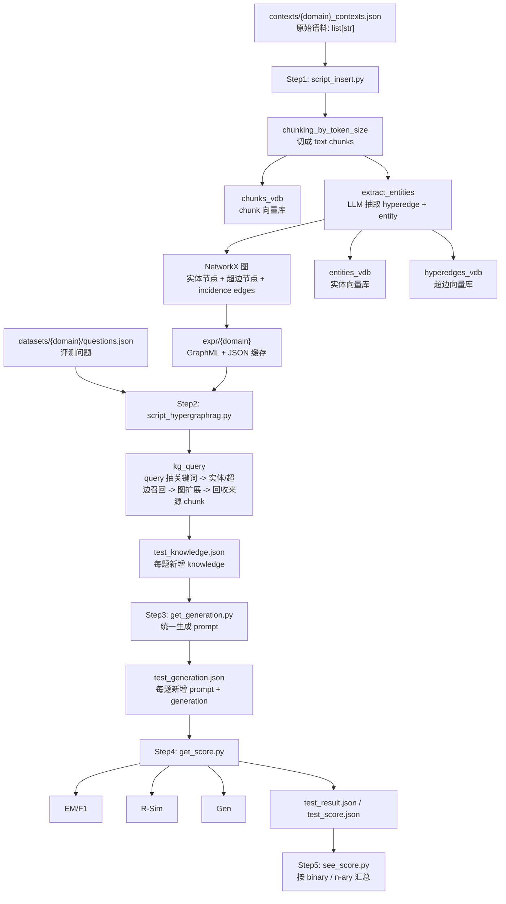

# HyperGraphRAG Code Walkthrough

这份文档面向“要给别人讲解这份代码的人”。

目标不是复述论文摘要，而是把仓库里的实际代码流程讲清楚:

1. 数据一开始是什么格式
2. 代码先处理什么, 后处理什么
3. 每一步会产出什么文件, 每个文件长什么样, 有什么作用
4. 检索上下文是怎么组装出来的
5. 最后怎么生成答案、怎么打分、各指标是什么意思
6. 当前仓库里有哪些实现细节和容易踩坑的地方

---

## 0. 先说结论: 这份仓库到底在做什么

如果只用一句话概括:

> HyperGraphRAG 先把长文本切成 chunk, 再让 LLM 从每个 chunk 中抽出“完整知识片段 + 相关实体”, 把它们建成一个“实体节点 + 超边节点”的二部图, 检索时同时从实体空间和超边空间召回, 再沿图扩展并回收来源 chunk, 最后把这些上下文拼成表格交给 LLM 回答问题。

和普通 chunk-RAG 的关键区别是:

- 它不是只检索 chunk
- 它把一个 n-ary fact 表示成一个 hyperedge, 不强行拆成多个二元关系
- 它在检索后不是直接拼 top-k 文本, 而是先组装结构化上下文, 再把来源文本一起交给生成模型

---

## 1. 先认清楚: 评测真正跑的是哪套代码

这是讲解时最值得先提醒别人的一个点。

仓库里有两套同名包:

- 根目录包: `hypergraphrag/`
- 评测目录包: `evaluation/hypergraphrag/`

而论文复现要求在 `evaluation/` 目录下运行:

```bash
cd evaluation
python script_insert.py --cls hypertension
```

此时 `from hypergraphrag import HyperGraphRAG` 实际导入的是:

- `evaluation/hypergraphrag/__init__.py`
- `evaluation/hypergraphrag/hypergraphrag.py`

所以:

- 讲论文评测流程时, 应该以 `evaluation/hypergraphrag/` 这套代码为准
- 根目录下的 `script_construct.py` / `script_query.py` 更像是一个最小 demo

相关入口:

- 评测 README: `evaluation/README.md`
- 评测入口: `evaluation/script_insert.py`
- 评测入口: `evaluation/script_hypergraphrag.py`
- 包入口: `evaluation/hypergraphrag/__init__.py`

---

## 2. 整体流程图



---

## 3. 输入数据是什么格式

### 3.1 原始知识语料: `contexts/{domain}_contexts.json`

这个文件是 Step1 的输入, 直接用于建图。

代码位置:

- `evaluation/script_insert.py:11-19`

从代码看, 它被当成一个 `list[str]` 读入:

```python
with open(file_path, mode="r", encoding="utf-8") as f:
    unique_contexts = json.load(f)
rag.insert(unique_contexts)
```

也就是说它的最小形式就是:

```json
[
  "长文本1...",
  "长文本2...",
  "长文本3..."
]
```

这份仓库里 `hypertension_contexts.json` 的真实情况:

- 文件位置: `evaluation/contexts/hypertension_contexts.json`
- 条数: `107`
- 每条是一大段原始医疗指南文本

第一条记录的形态就是一整段长字符串, 例如:

```json
[
  "2024 ESC Guidelines for the management of elevated blood pressure and hypertension ..."
]
```

它没有额外字段, 没有 `title`, 没有 `metadata`, 就是纯文本列表。

### 3.2 评测问题文件: `datasets/{domain}/questions.json`

这个文件是 Step2-5 的输入。

代码位置:

- `evaluation/script_hypergraphrag.py:28-37`
- `evaluation/get_score.py:21-38`
- `evaluation/see_score.py:33-39`

实际字段如下:

```json
{
  "question": "What are the potential consequences of increasing the implementation of renal denervation, particularly concerning long-term outcomes and complications?",
  "golden_answers": [
    "IMPACT OF SCALING UP RENAL DENERVATION"
  ],
  "context": [
    "Fourth, related to the lack of outcomes data, the potentially 'always on' effect of renal denervation could backfire if late complications emerge."
  ],
  "nary": 2,
  "nhop": 1
}
```

字段含义:

- `question`: 要回答的问题
- `golden_answers`: 标准答案列表, 用于 EM/F1
- `context`: 构造该问题时使用的黄金支撑知识, 用于 R-Sim
- `nary`: 事实元数标记
  - `2` 表示 binary
  - `>2` 表示 n-ary
- `nhop`: 推理 hop 数
  - `1 / 2 / 3`

以 `hypertension` 为例, 当前真实分布是:

- 总问题数: `512`
- `nary == 2`: `256`
- `nary > 2`: `256`
- `nhop == 1`: `256`
- `nhop == 2`: `128`
- `nhop == 3`: `128`

---

## 4. Step1: 建图流程详解

Step1 入口:

- `evaluation/script_insert.py`

命令:

```bash
python script_insert.py --cls hypertension
```

### 4.1 Step1 的入口脚本做了什么

代码位置:

- `evaluation/script_insert.py:29-58`

逻辑很简单:

1. 解析 `--cls`
2. 设置 `WORKING_DIR = expr/{cls}`
3. 组装 `HyperGraphRAG(...)` 的参数
4. 读取 `contexts/{cls}_contexts.json`
5. 调用 `rag.insert(unique_contexts)`

这个脚本还做了两件工程上的事:

- 对插入过程最多重试 `10` 次
- 支持通过环境变量控制并发:
  - `HGRAG_INSERT_LLM_MAX_ASYNC`
  - `HGRAG_ENTITY_SUMMARY_LLM_MAX_ASYNC`

### 4.2 `HyperGraphRAG` 初始化时创建了哪些存储

核心类:

- `evaluation/hypergraphrag/hypergraphrag.py:109-265`

最关键的初始化参数:

- `chunk_token_size = 1200`
- `chunk_overlap_token_size = 100`
- `embedding_batch_num = 32`，本地 Qwen 模式下会自动降到 `8`
- `embedding_func_max_async = 16`，本地 Qwen 模式下会自动降到 `1`
- `llm_model_max_async = 16`
- `entity_summary_llm_max_async = 1`

初始化时会创建这些存储对象:

- `full_docs`: 原始文档 KV
- `text_chunks`: chunk KV
- `chunk_entity_relation_graph`: 图存储
- `entities_vdb`: 实体向量库
- `hyperedges_vdb`: 超边向量库
- `chunks_vdb`: chunk 向量库
- `llm_response_cache`: LLM 响应缓存

对应代码:

- `evaluation/hypergraphrag/hypergraphrag.py:225-257`

### 4.3 当前仓库支持“本地 embedding + 远程 LLM”

这是当前代码比原 README 更重要的一个实现细节。

原 README 默认写法是:

```text
your_openai_api_key
https://your-openai-compatible-endpoint/v1
gpt-4o-mini
text-embedding-3-small
```

但当前仓库已经支持把第 4 行写成:

```text
local:Qwen/Qwen3-Embedding-0.6B
```

触发逻辑在:

- `evaluation/hypergraphrag/openai_config.py:137-160`
- `evaluation/hypergraphrag/llm.py:59-60`
- `evaluation/hypergraphrag/llm.py:836-843`

也就是说:

- LLM 聊天/抽取仍走远程 OpenAI-compatible API
- embedding 改为本地 Qwen3-Embedding-0.6B

### 4.4 文档去重与 chunking

插入主流程:

- `evaluation/hypergraphrag/hypergraphrag.py:291-353`

处理顺序:

1. 如果输入是字符串, 先包成列表
2. 对每篇文档计算哈希 ID:
   - `doc-{md5}`
3. 调 `full_docs.filter_keys(...)` 跳过已存在文档
4. 对每篇文档做 chunking

chunking 逻辑在:

- `evaluation/hypergraphrag/operate.py:48-66`

核心规则:

```python
for start in range(0, len(tokens), max_token_size - overlap_token_size):
```

因此每个 chunk:

- 最长 `1200` token
- 相邻 chunk 重叠 `100` token

产出的 chunk 结构是:

```json
{
  "tokens": 1140,
  "content": "chunk 文本 ...",
  "chunk_order_index": 0,
  "full_doc_id": "doc-126142dd304832fbc1e098806b953dd1"
}
```

写入位置:

- `evaluation/expr/{domain}/kv_store_text_chunks.json`

对应 schema 定义:

- `evaluation/hypergraphrag/base.py:8-11`

### 4.5 chunk 向量库先建好

在正式抽实体前, 所有 chunk 先进入 `chunks_vdb`:

- `evaluation/hypergraphrag/hypergraphrag.py:337`

这里用的是 `NanoVectorDBStorage`:

- `evaluation/hypergraphrag/storage.py:67-175`

向量库写入规则:

- 输入字典里必须有 `content`
- 代码会对 `content` 做 embedding
- 然后把向量和部分元数据写入 `vdb_chunks.json`

注意:

- `chunks_vdb` 在 Step1 会构建
- 但当前 `kg_query` 主链里并不会直接调用 `chunks_vdb.query(...)`
- 查询阶段主要还是通过 `source_id -> text_chunks` 回溯原始 chunk

这是当前实现里很容易讲漏掉的一个点。

### 4.6 LLM 如何从 chunk 中抽出 n-ary 事实

核心函数:

- `evaluation/hypergraphrag/operate.py:285-505`

Prompt 模板:

- `evaluation/hypergraphrag/prompt.py:13-45`

这份 prompt 不是让模型直接抽二元关系, 而是两步:

1. 先把文本切成若干“完整知识片段”
2. 对每个知识片段抽实体

也就是 prompt 明确要求输出两种 record:

#### 4.6.1 hyperedge record

格式:

```text
("hyper-relation"<|><knowledge_segment><|><completeness_score>)
```

解析代码:

- `evaluation/hypergraphrag/operate.py:139-155`

解析结果:

```python
{
  "hyper_relation": "<hyperedge>" + knowledge_fragment,
  "weight": completeness_score,
  "source_id": chunk_key
}
```

#### 4.6.2 entity record

格式:

```text
("entity"<|><entity_name><|><entity_type><|><entity_description><|><key_score>)
```

解析代码:

- `evaluation/hypergraphrag/operate.py:111-136`

解析结果:

```python
{
  "entity_name": entity_name,
  "entity_type": entity_type,
  "description": entity_description,
  "weight": key_score,
  "hyper_relation": now_hyper_relation,
  "source_id": chunk_key
}
```

### 4.7 一个细节: 实体和超边靠“顺序”绑定

这个实现细节非常重要。

在 `_process_single_content(...)` 里:

- 代码一边遍历 LLM 输出 records
- 一边维护 `now_hyper_relation`
- 当读到 `"hyper-relation"` 时, 更新当前超边
- 后续读到的 `"entity"` 就挂到这个 `now_hyper_relation` 上

对应代码:

- `evaluation/hypergraphrag/operate.py:370-395`

这意味着:

- LLM 输出顺序非常重要
- hyperedge 不是通过显式 ID 绑定实体的
- 而是通过“当前最近出现的 hyper-relation record”绑定的

### 4.8 Gleaning: 抽取不是只调一次 LLM

在每个 chunk 上, 代码会:

1. 先做第一次抽取
2. 再跑若干次补抽
3. 用一个 yes/no prompt 判断是否还需要继续补

对应代码:

- `evaluation/hypergraphrag/operate.py:348-363`

相关 prompt:

- `entiti_continue_extraction`: `evaluation/hypergraphrag/prompt.py:178-181`
- `entiti_if_loop_extraction`: `evaluation/hypergraphrag/prompt.py:183-186`

默认参数:

- `entity_extract_max_gleaning = 2`

所以每个 chunk 不是一次抽完就结束, 而是最多额外补抽两轮。

### 4.9 为什么图里不是“实体点 + 关系边”, 而是“实体点 + 超边点”

真正的存图方式是一个二部图:

- 实体是节点
- hyperedge 也是节点
- 实体与 hyperedge 之间连 incidence edge

对应代码:

- hyperedge 节点写入: `evaluation/hypergraphrag/operate.py:158-188`
- entity 节点写入: `evaluation/hypergraphrag/operate.py:191-236`
- hyperedge-entity 边写入: `evaluation/hypergraphrag/operate.py:239-282`

节点 schema:

#### entity 节点

```python
{
  "role": "entity",
  "entity_type": entity_type,
  "description": description,
  "source_id": source_id
}
```

#### hyperedge 节点

```python
{
  "role": "hyperedge",
  "weight": weight,
  "source_id": source_id
}
```

#### incidence edge

```python
{
  "weight": weight,
  "source_id": source_id
}
```

真实图文件里的样子, 例如:

- 节点 ID:
  - `<hyperedge>"This can be challenging to implement, especially in resource-poor settings."`
- 节点属性:
  - `{'role': 'hyperedge', 'weight': 7.0, 'source_id': 'chunk-414f59a48e972ecdb40ab6acc4e8a95d'}`
- 边:
  - `('<hyperedge>"This can be challenging to implement, especially in resource-poor settings."', '"IMPLEMENTATION"', {'weight': 80.0, 'source_id': 'chunk-414f59a48e972ecdb40ab6acc4e8a95d'})`

这就是 HyperGraphRAG 的“超图”在工程里如何落地:

- 不是原生 hypergraph 数据结构
- 而是“超边也当节点”的二部图表达

### 4.10 重复实体怎么合并

同一个实体可能在很多 chunk、很多 hyperedge 里出现。

合并逻辑:

- `evaluation/hypergraphrag/operate.py:191-236`

规则:

- `entity_type`: 取出现频率最高的类型
- `description`: 把多个描述用 `<SEP>` 拼起来, 再交给 LLM 总结
- `source_id`: 合并多个来源 chunk ID

这里还有一个很重要的后处理:

- `_handle_entity_relation_summary(...)`
- 位置: `evaluation/hypergraphrag/operate.py:69-108`

如果合并后的描述太长:

- 超过 `entity_summary_to_max_tokens = 500`
- 就再调一次 LLM 生成一个压缩后的统一描述

这个阶段在大数据集上非常耗 API, 也是 Step1 最容易慢或被限流的地方。

### 4.11 向量库里分别存了什么

#### entities_vdb

写入代码:

- `evaluation/hypergraphrag/operate.py:495-503`

内容:

```python
{
  "content": entity_name + description,
  "entity_name": entity_name
}
```

因此实体召回依赖的是:

- 实体名
- 合并后的实体描述

#### hyperedges_vdb

写入代码:

- `evaluation/hypergraphrag/operate.py:485-493`

内容:

```python
{
  "content": hyperedge_name,
  "hyperedge_name": hyperedge_name
}
```

因此超边召回主要依赖 hyperedge 文本本身。

#### chunks_vdb

写入代码:

- `evaluation/hypergraphrag/hypergraphrag.py:337`

内容:

```python
{
  "content": chunk_content,
  ...
}
```

### 4.12 Step1 最终会落哪些文件

落盘逻辑:

- `evaluation/hypergraphrag/hypergraphrag.py:358-372`

默认落到:

- `evaluation/expr/{domain}/kv_store_full_docs.json`
- `evaluation/expr/{domain}/kv_store_text_chunks.json`
- `evaluation/expr/{domain}/kv_store_llm_response_cache.json`
- `evaluation/expr/{domain}/vdb_chunks.json`
- `evaluation/expr/{domain}/vdb_entities.json`
- `evaluation/expr/{domain}/vdb_hyperedges.json`
- `evaluation/expr/{domain}/graph_chunk_entity_relation.graphml`

以已经跑通的 `hypertension` 为例, 当前真实规模是:

- 文档数: `107`
- chunks: `225`
- entity vectors: `10851`
- hyperedge vectors: `5067`
- graph nodes: `15918`
- graph edges: `19951`

其中:

- `15918 = 10851 entity nodes + 5067 hyperedge nodes`

---

## 5. Step2: 检索流程详解

Step2 入口:

- `evaluation/script_hypergraphrag.py`

命令:

```bash
python script_hypergraphrag.py --data_source hypertension
```

### 5.1 Step2 入口脚本做了什么

代码位置:

- `evaluation/script_hypergraphrag.py:11-50`

流程:

1. 读 `datasets/{data_source}/questions.json`
2. 取出所有 `question`
3. 并发执行 `rag.aquery(q, QueryParam(only_need_context=True))`
4. 把返回的上下文写回 `d["knowledge"]`
5. 保存成 `results/HyperGraphRAG/{data_source}/test_knowledge.json`

默认检索参数:

- `QueryParam.mode = "hybrid"`
- `only_need_context = True`

定义在:

- `evaluation/hypergraphrag/base.py:16-32`

### 5.2 一个反直觉细节: query 也先跑一次“抽取 prompt”

核心函数:

- `evaluation/hypergraphrag/operate.py:508-658`

`kg_query(...)` 并不是直接把 query 去向量库里搜。

它先复用了和 Step1 同一套 `entity_extraction` prompt, 把 query 本身也解析成:

- 低层关键词 `ll_keywords`: 实体
- 高层关键词 `hl_keywords`: hyperedge

对应代码:

- `evaluation/hypergraphrag/operate.py:561-607`

规则:

- `"hyper-relation"` -> 进入 `hl_keywords`
- `"entity"` -> 进入 `ll_keywords`

如果抽不到:

- local/hybrid 模式下, `ll_keywords = 原 query`
- global/hybrid 模式下, `hl_keywords = 原 query`

也就是说, 当前实现不是独立的 keyword extractor, 而是把 query 当“小文本”再次跑实体/超边抽取。

### 5.3 `QueryParam` 控制的是什么

定义:

- `evaluation/hypergraphrag/base.py:16-32`

关键参数:

- `mode`
  - `local`
  - `global`
  - `hybrid`
  - `naive`
- `top_k = 60`
  - local 模式下用于实体召回
  - global 模式下用于超边召回
- `max_token_for_text_unit = 4000`
- `max_token_for_global_context = 4000`
- `max_token_for_local_context = 4000`

### 5.4 local / global / hybrid 分别是什么意思

构造上下文的核心函数:

- `evaluation/hypergraphrag/operate.py:662-756`

#### local

调用:

- `_get_node_data(...)`
- 位置: `evaluation/hypergraphrag/operate.py:759-828`

逻辑:

1. 在 `entities_vdb` 检索相似实体
2. 从图里取这些实体节点
3. 找与这些实体相邻的 hyperedges
4. 再根据 `source_id` 回收相关 chunk

#### global

调用:

- `_get_edge_data(...)`
- 位置: `evaluation/hypergraphrag/operate.py:955-1039`

逻辑:

1. 在 `hyperedges_vdb` 检索相似超边
2. 从图里取这些超边节点
3. 找这些超边相连的实体
4. 再根据 `source_id` 回收相关 chunk

#### hybrid

逻辑:

1. 同时跑 local 和 global
2. 把两边的实体表、关系表、来源表合并去重

合并函数:

- `evaluation/hypergraphrag/operate.py:1132-1148`
- `evaluation/hypergraphrag/utils.py:298-332`

### 5.5 local 路径: 从实体出发如何扩展

#### 5.5.1 先召回实体

代码:

- `evaluation/hypergraphrag/operate.py:767`

```python
results = await entities_vdb.query(query, top_k=query_param.top_k)
```

之后会取:

- 节点属性
- 节点 degree

对应:

- `evaluation/hypergraphrag/operate.py:771-785`

#### 5.5.2 再找相关 text units

函数:

- `_find_most_related_text_unit_from_entities(...)`
- `evaluation/hypergraphrag/operate.py:831-902`

做法:

1. 从每个实体节点的 `source_id` 取出来源 chunk ID
2. 再看该实体连接到哪些 hyperedges
3. 再看这些一跳邻居节点也指向哪些 chunk
4. 用 `order` 和 `relation_counts` 对候选 chunk 排序
5. 按 token budget 截断

#### 5.5.3 再找相关 hyperedges

函数:

- `_find_most_related_edges_from_entities(...)`
- `evaluation/hypergraphrag/operate.py:905-952`

做法:

1. 获取这些实体的所有相邻边
2. 去重
3. 取边属性和边 degree
4. 排序后按 token budget 截断
5. 再补上 `related_nodes`

local 模式最终输出三张 CSV 表:

- `Entities`
- `Relationships`
- `Sources`

### 5.6 global 路径: 从超边出发如何扩展

#### 5.6.1 先召回 hyperedges

代码:

- `evaluation/hypergraphrag/operate.py:962`

```python
results = await hyperedges_vdb.query(keywords, top_k=query_param.top_k)
```

#### 5.6.2 再从超边找到相关实体

函数:

- `_find_most_related_entities_from_relationships(...)`
- `evaluation/hypergraphrag/operate.py:1042-1079`

做法:

1. 取每个 hyperedge 的邻接实体
2. 去重
3. 取实体节点信息和 degree
4. 截断

#### 5.6.3 再从超边回收相关 chunk

函数:

- `_find_related_text_unit_from_relationships(...)`
- `evaluation/hypergraphrag/operate.py:1082-1129`

做法:

1. 读取 hyperedge 节点的 `source_id`
2. 去 `text_chunks_db` 取原始 chunk 内容
3. 排序、截断

### 5.7 最终 `knowledge` 是什么格式

`kg_query(..., only_need_context=True)` 返回的是一整个字符串, 不是 JSON。

格式如下:

````text
-----Entities-----
```csv
id,	entity,	type,	description
...
```
-----Relationships-----
```csv
id,	hyperedge,	related_entities
...
```
-----Sources-----
```csv
id,	content
...
```
````

对应代码:

- `evaluation/hypergraphrag/operate.py:743-756`

这也是 `test_knowledge.json` 里 `knowledge` 字段的真实内容。

### 5.8 Step2 产物长什么样

输出文件:

- `evaluation/results/HyperGraphRAG/{domain}/test_knowledge.json`

单条记录字段:

```json
{
  "question": "...",
  "golden_answers": ["..."],
  "context": ["..."],
  "nary": 2,
  "nhop": 1,
  "knowledge": "-----Entities----- ... -----Relationships----- ... -----Sources----- ..."
}
```

也就是说 Step2 只是给原问题样本新增了一个 `knowledge` 字段。

---

## 6. Step3: 生成流程详解

Step3 入口:

- `evaluation/get_generation.py`

命令:

```bash
python get_generation.py --data_sources hypertension --methods HyperGraphRAG
```

### 6.1 Step3 的输入是什么

输入文件:

- `results/{method}/{data_source}/test_knowledge.json`

也就是 Step2 的检索结果。

### 6.2 Step3 的 prompt 长什么样

核心代码:

- `evaluation/get_generation.py:29-66`

Prompt 结构:

1. `---Knowledge---`
2. 直接塞进 `d["knowledge"]`
3. 要求模型先在 `<think>...</think>` 里推理
4. 最终答案放在 `<answer>...</answer>`
5. 再附上原始问题

注意:

- 这里没有复用 `PROMPTS["rag_response"]`
- 而是 Step3 自己单独写了一份生成 prompt

### 6.3 Step3 输出什么

输出文件:

- `evaluation/results/{method}/{data_source}/test_generation.json`

单条记录字段:

```json
{
  "question": "...",
  "golden_answers": ["..."],
  "context": ["..."],
  "nary": 2,
  "nhop": 1,
  "knowledge": "...",
  "prompt": "...",
  "generation": "..."
}
```

新增字段:

- `prompt`
- `generation`

`generation` 就是模型完整输出, 通常包含:

- `<think>...</think>`
- `<answer>...</answer>`

---

## 7. Step4: 评分流程详解

Step4 入口:

- `evaluation/get_score.py`

命令:

```bash
python get_score.py --data_source hypertension --method HyperGraphRAG
```

### 7.1 Step4 的输入是什么

输入文件:

- `results/{method}/{data_source}/test_generation.json`

### 7.2 单条样本如何评分

核心函数:

- `evaluation/get_score.py:21-46`

流程:

1. 从 `generation` 里抽取 `<answer>...</answer>` 作为最终答案
2. 用 `golden_answers` 算 EM
3. 用 `golden_answers` 算 F1
4. 用 `context` 与 `knowledge` 算 R-Sim
5. 用 `question + golden_answers + generation + f1_score` 算 Gen

产出字段:

- `em`
- `f1`
- `rsim`
- `gen`
- `gen_exp`

### 7.3 EM 和 F1 是怎么算的

实现:

- `evaluation/eval.py`

预处理:

- 小写化
- 去标点
- 去冠词 `a/an/the`
- 规整空白

#### EM

- 归一化后完全相同记为 `1`
- 否则记为 `0`

#### F1

- 对 token 级 overlap 计算 precision / recall / F1
- 多个 `golden_answers` 取最大值

### 7.4 R-Sim 是什么

实现:

- `evaluation/eval_r.py`

逻辑:

1. 把 `context` 去重后拼成一个字符串
2. 把 `knowledge` 当作检索上下文字符串
3. 用 `SimCSE("princeton-nlp/sup-simcse-roberta-large")` 计算语义相似度

所以:

- `R-Sim` 不是答案分
- 它衡量“检索出来的知识”和“黄金支撑知识”是否相似

### 7.5 Gen 是什么

实现:

- `evaluation/eval_g.py`

这是 Step4 最复杂、也最慢的一项。

它会让 LLM 从 7 个维度分别打分:

- `comprehensiveness`
- `knowledgeability`
- `correctness`
- `relevance`
- `diversity`
- `logical_coherence`
- `factuality`

每个维度:

1. 构造一份 judge prompt
2. 让模型返回:
   - `<score>0-10</score>`
   - `<explanation>...</explanation>`
3. 再把该维度分数归一化到 `0-1`
4. 再与该样本的 `f1_score` 平均

公式对应代码:

- `evaluation/eval_g.py:158-162`

```python
score = score / 10
score = (score + f1_score) / 2
```

最后:

- 对 7 个维度的结果求平均
- 得到该样本的 `gen`

所以 `Gen` 不是纯 LLM 主观打分, 它混入了该样本的 F1。

### 7.6 为什么 Step4 特别慢

原因基本就是 `Gen`。

如果有 `512` 条样本:

- 每条样本做 `7` 次 LLM judge
- 总 judge 调用约 `512 x 7 = 3584`

所以 Step4 的主要瓶颈不是 EM/F1 或 R-Sim, 而是 `Gen` 的大量远程 LLM 调用。

### 7.7 Step4 输出什么

两个文件:

- 样本级结果:
  - `evaluation/results/{method}/{data_source}/test_result.json`
- 汇总结果:
  - `evaluation/results/{method}/{data_source}/test_score.json`

`test_result.json` 单条记录字段:

```json
{
  "question": "...",
  "golden_answers": ["..."],
  "context": ["..."],
  "nary": 2,
  "nhop": 1,
  "knowledge": "...",
  "prompt": "...",
  "generation": "...",
  "em": 0.0,
  "f1": 0.42,
  "rsim": 0.67,
  "gen": 0.56,
  "gen_exp": {
    "comprehensiveness": {...},
    "knowledgeability": {...},
    ...
  }
}
```

`test_score.json` 字段:

```json
{
  "overall_em": 0.212890625,
  "overall_f1": 0.3440192224559294,
  "overall_rsim": 0.6652908680262044,
  "overall_gen": 0.5562890624999999
}
```

---

## 8. Step5: 结果展示做了什么

Step5 入口:

- `evaluation/see_score.py`

命令:

```bash
python see_score.py --data_source hypertension --method HyperGraphRAG
```

逻辑非常简单:

1. 读取 `test_score.json`
2. 读取 `test_result.json`
3. 按 `nary` 分两组
   - `nary == 2` -> binary
   - `nary > 2` -> n-ary
4. 分别统计 `f1 / rsim / gen`
5. 再打印 overall

注意:

- Step5 不按 `nhop` 统计
- 只按 `nary` 分组

---

## 9. baseline 是怎么做的

这部分讲代码时很重要, 因为很多人会默认以为 baseline 是“完整独立实现”。

### 9.1 StandardRAG

脚本:

- `evaluation/script_standardrag.py`

它不是重新跑一个独立的 chunk 向量检索。

它的做法是:

1. 先读取 `HyperGraphRAG` 的 `test_knowledge.json`
2. 直接把 `knowledge` 截成 `-----Sources-----` 后面的部分
3. 存为 `results/StandardRAG/.../test_knowledge.json`

也就是说当前仓库里的 StandardRAG 更像:

> “只保留 HyperGraphRAG 检索上下文里的 Sources 部分”

而不是从零做一个标准的 dense chunk retrieval baseline。

### 9.2 NaiveGeneration

脚本:

- `evaluation/script_naivegeneration.py`

做法:

- 直接把 `knowledge` 置空字符串 `""`

所以它表示:

> 不给检索知识, 让生成模型裸答

---

## 10. 真实产物文件应该怎么讲

这一部分适合在向别人讲代码时直接对应文件解释。

### 10.1 `kv_store_full_docs.json`

作用:

- 原始文档缓存
- 避免重复插入

形式:

```json
{
  "doc-xxxx": {
    "content": "原始长文"
  }
}
```

### 10.2 `kv_store_text_chunks.json`

作用:

- 保存 chunk 内容及其来源文档
- 检索阶段通过 `source_id` 回收原始 chunk

形式:

```json
{
  "chunk-xxxx": {
    "tokens": 1140,
    "content": "...",
    "chunk_order_index": 0,
    "full_doc_id": "doc-xxxx"
  }
}
```

### 10.3 `vdb_chunks.json`

作用:

- chunk 向量索引

注意:

- 当前主检索链并不直接调用它

### 10.4 `vdb_entities.json`

作用:

- 实体向量索引

真实文件里开头长这样:

```json
{
  "embedding_dim": 1024,
  "data": [
    {
      "__id__": "ent-...",
      "entity_name": "\"FIGURE 7\""
    }
  ]
}
```

### 10.5 `vdb_hyperedges.json`

作用:

- 超边向量索引

真实文件里开头长这样:

```json
{
  "__id__": "rel-e88c49f9082d8e6798431d2e39edf323",
  "hyperedge_name": "<hyperedge>\"This can be challenging to implement, especially in resource-poor settings.\""
}
```

### 10.6 `graph_chunk_entity_relation.graphml`

作用:

- 最终的知识图主体

不是普通二元知识图, 而是:

- entity nodes
- hyperedge nodes
- hyperedge <-> entity incidence edges

---

## 11. 当前仓库里最重要的实现细节与坑

### 11.1 查询时不是直接搜 chunk

虽然 Step1 构建了 `chunks_vdb`, 但 `kg_query(...)` 的主路径只用了:

- `entities_vdb`
- `hyperedges_vdb`
- `text_chunks_db`

其中 `text_chunks_db` 是 KV, 不是向量召回。

所以当前检索更准确地说是:

> 先做实体/超边召回, 再通过 `source_id` 回溯 chunk

而不是“三路都独立向量检索后融合”。

### 11.2 hyperedge 的文本就是事实片段本身

当前实现里 `hyperedge_name` 不是一个抽象 relation label, 而是:

- `"<hyperedge>" + knowledge_segment sentence`

这让超边检索更像“语义事实片段检索”, 而不是 schema-level relation retrieval。

### 11.3 图是 `networkx.Graph`, 不是原生 hypergraph

存储后端:

- `evaluation/hypergraphrag/storage.py:177-317`

默认用的是 `nx.Graph()`。

所以:

- 这是“用普通图模拟超图”
- 不是 native hypergraph database

### 11.4 实体描述会被再次 LLM 总结

这会提高实体描述质量, 但也会:

- 很耗 API
- 很容易触发 rate limit
- 影响 Step1 总时长

### 11.5 Step3 生成 prompt 会把完整 `knowledge` 和完整 `prompt` 都落盘

所以:

- `test_generation.json` 很大
- 不适合频繁手动 diff

### 11.6 Step4 的 `Gen` 不是纯 judge 分

它每个维度都会和 `f1_score` 再取平均:

```python
score = (judge_score + f1_score) / 2
```

所以:

- `Gen` 不是一个完全独立于答案匹配的指标

### 11.7 当前 repo 的 `StandardRAG` 不算严格的标准基线

因为它不是单独实现的 chunk retrieval, 而是直接复用 HyperGraphRAG 的 `Sources`。

如果你要做严格对照实验, 这一点必须说明。

---

## 12. 如果你要给别人讲这份代码, 推荐按这个顺序讲

### 第一层: 3 分钟讲清整体

先讲:

1. 数据有两类
   - `contexts`: 建图语料
   - `questions`: 评测样本
2. 整体 5 步
   - Step1 建图
   - Step2 检索
   - Step3 生成
   - Step4 评分
   - Step5 汇总
3. 超图在工程里的落地方式
   - hyperedge 也是节点
   - entity 和 hyperedge 构成二部图

### 第二层: 10 分钟讲代码主线

按这几个文件讲:

1. `evaluation/script_insert.py`
2. `evaluation/hypergraphrag/hypergraphrag.py`
3. `evaluation/hypergraphrag/operate.py`
4. `evaluation/script_hypergraphrag.py`
5. `evaluation/get_generation.py`
6. `evaluation/get_score.py`
7. `evaluation/see_score.py`

### 第三层: 细节和坑

重点补这些:

1. query 也复用了实体抽取 prompt
2. 当前查询主链并不直接使用 `chunks_vdb`
3. StandardRAG 基线只是 `Sources`
4. Gen 评分是 7 个维度的 LLM judge, 并且与 F1 混合
5. 评测运行时实际导入的是 `evaluation/hypergraphrag`, 不是根目录包

---

## 13. 一个完整的字段流转视角

把整个实验看成“字段怎么流动”, 会更容易讲清楚。

### Step1

输入:

```json
[
  "doc text 1",
  "doc text 2"
]
```

中间:

```json
{
  "chunk-xxx": {
    "tokens": 1140,
    "content": "...",
    "chunk_order_index": 0,
    "full_doc_id": "doc-xxx"
  }
}
```

再中间:

```python
{
  "entity_name": "\"RENAL DENERVATION\"",
  "entity_type": "PROCEDURE",
  "description": "...",
  "weight": 95.0,
  "hyper_relation": "<hyperedge>Fourth, related to the lack of outcomes data ...",
  "source_id": "chunk-..."
}
```

输出:

- 图文件
- 3 个向量库
- 2 个 KV 文件

### Step2

输入:

```json
{
  "question": "...",
  "golden_answers": ["..."],
  "context": ["..."],
  "nary": 2,
  "nhop": 1
}
```

输出:

```json
{
  "...": "...",
  "knowledge": "-----Entities----- ... -----Relationships----- ... -----Sources----- ..."
}
```

### Step3

输出:

```json
{
  "...": "...",
  "prompt": "...",
  "generation": "<think>...</think><answer>...</answer>"
}
```

### Step4

输出:

```json
{
  "...": "...",
  "em": 0.0,
  "f1": 0.42,
  "rsim": 0.67,
  "gen": 0.56,
  "gen_exp": {...}
}
```

### Step5

输出:

- overall
- binary vs n-ary 分组结果

---

## 14. 结合当前 `hypertension` 跑通结果, 可以怎么讲

当前这份仓库已经实际跑通了 `hypertension`。

可以用下面这组数字帮助别人建立直觉:

### 数据规模

- 文档数: `107`
- chunk 数: `225`
- 题目数: `512`

### 图规模

- entity vectors: `10851`
- hyperedge vectors: `5067`
- graph nodes: `15918`
- graph edges: `19951`

### 最终分数

- `overall_em = 0.2129`
- `overall_f1 = 0.3440`
- `overall_rsim = 0.6653`
- `overall_gen = 0.5563`

按 `nary` 分组:

- binary
  - `F1 = 34.60`
  - `R-Sim = 66.22`
  - `Gen = 56.09`
- n-ary
  - `F1 = 34.20`
  - `R-Sim = 66.84`
  - `Gen = 55.17`

这组结果很适合讲下面这句话:

> 在当前实现里, HyperGraphRAG 的检索相关性已经明显高于答案匹配分, 说明它能找到比较像样的支撑知识, 但这些检索优势并没有完全转化成生成质量。

---

## 15. 最后给一个最简版心智模型

如果你只想用 30 秒给别人讲清楚, 可以这样说:

> 这份代码把长文档切成 chunk, 用 LLM 从每个 chunk 里抽“完整事实片段”和“片段里的实体”, 再把“事实片段”作为 hyperedge 节点、“实体”作为 entity 节点建成二部图。查询时先把问题也抽成实体关键词和超边关键词, 分别在实体向量库和超边向量库召回, 然后沿图扩展并回收原始 chunk, 拼成 `Entities / Relationships / Sources` 三张表交给 LLM 生成答案。最后用 EM/F1 评答案, 用 SimCSE 评检索上下文与黄金 context 的相似度, 再用一个 7 维的 LLM judge 评生成质量。 

---

## 16. 相关代码索引

如果要快速跳转, 这些文件最重要:

- 评测总说明: `evaluation/README.md`
- Step1 入口: `evaluation/script_insert.py`
- Step2 入口: `evaluation/script_hypergraphrag.py`
- Step3 入口: `evaluation/get_generation.py`
- Step4 入口: `evaluation/get_score.py`
- Step5 汇总: `evaluation/see_score.py`
- 主类: `evaluation/hypergraphrag/hypergraphrag.py`
- 核心算法: `evaluation/hypergraphrag/operate.py`
- 存储实现: `evaluation/hypergraphrag/storage.py`
- 接口定义: `evaluation/hypergraphrag/base.py`
- Prompt: `evaluation/hypergraphrag/prompt.py`
- LLM 与 embedding: `evaluation/hypergraphrag/llm.py`
- API 配置解析: `evaluation/hypergraphrag/openai_config.py`
- 工具函数: `evaluation/hypergraphrag/utils.py`
